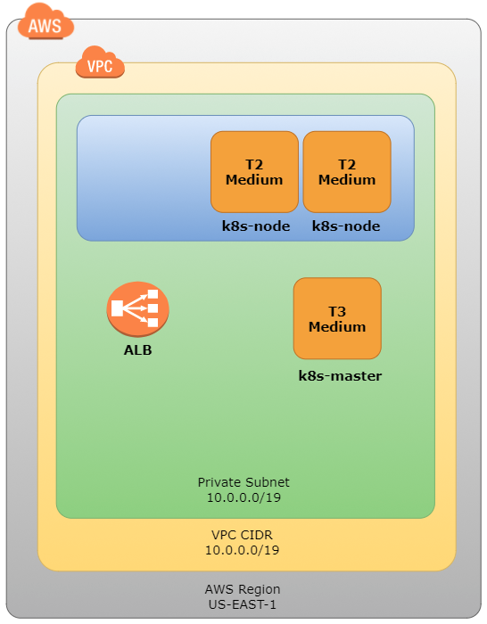

# Potato2
Senior Design Final Project, Kubernetes on EC2 instances.

### <b>Tools/technology being used</b>
- AWS
    - CLI
    - EC2
- Docker
- Git
- Kubernetes
    - Kubectl
    - Kops
    - Minikube
- Virtualbox/VMware

#
### <b>Diagram of infrastructure</b>


#
### <b>How to execute the code</b>

### Setting up Kubernetes on a Virtual Machine
#### Install VirtualBox or VMWare
1. Run the following command:
    ```
    sudo apt-get install virtualbox
    ```

2. Make sure that Intel VT-x/EPT or AMD-V/RVI is enabled.

#
#### Install Kubectl
1. Run the following commands:
    ```
    sudo apt-get update && sudo apt-get install -y apt-transport-https curl
    curl -s https://packages.cloud.google.com/apt/doc/apt-key.gpg | sudo apt-key add -
    echo "deb https://apt.kubernetes.io/ kubernetes-xenial main" | sudo tee -a /etc/apt/sources.list.d/kubernetes.list
    sudo apt-get update
    sudo apt-get install -y kubectl
    ```

#
#### Install Docker
1. Run the following command:
    ```
    sudo apt-get install docker
    ```

#
#### Install Minikube
1. Run the following commands:
    ```
    curl -LO https://storage.googleapis.com/minikube/releases/latest/minikube-linux-amd64
    sudo install minikube-linux-amd64 /usr/local/bin/minikube
    ```

2. Make sure Intel VT-x/EPT or AMD-V/RVI is enabled.

#
#### Run Minikube
0. Run the following commands:
    ```
    sudo chown -R $(id -u):$(id -g) ~/.minikube/*

    sudo chown -R $(id -u):$(id -g) ~/.kube/*
    ```

1. Run this command to start Minikube
    ```
    minikube start
    ```

2. Run these commands to check that the cluster is running:
    ```
    kubectl get nodes
    kubectl cluster-info
    ```

3. Start the minikube dashbaord:
    ```
    minikube dashboard
    ```

4. Visit your minikube dashboard:
http://127.0.0.1:34191/api/v1/namespaces/kube-system/services/http:kubernetes-dashboard:/proxy/#!/cluster?namespace=default


#
### <b>Setting up Kubernetes on a AWS using Windows 10</b>
#### Installing the requirements
1. Download and install AWS CLI: https://aws.amazon.com/cli/
2. Download and move kubectl: https://kubernetes.io/docs/tasks/tools/install-kubectl/ 
then move it to the directory C:\Kube
3. Download kops: https://github.com/kubernetes/kops, then rename the download to kops.exe. Finally move the file to C:\Kube
4. Add AWS CLI, kubectl, and kops to path:
    1. Press the windows key then type in ```env```
    2. Select the option that says ```Edit the system environment variables```
    3. Click on ```Environment Variables```
    4. Under ```System Variables```, double click ```Path```.
    5. Select new and add ```C:\Program Files\Amazon\AWSCLI\bin```
    6. Select new and add ```C:\Kube```
5. Restart your computer.

#
#### Setting up the Kubernetes Cluster
1. Run the following command in order to create a S3 bucket for kops to use. 
    ```
    aws s3api create-bucket --bucket potato2-kops-state-store --region us-east-1
    ```
2. Enable versioning on the newly created bucket:
    ```
    aws s3api put-bucket-versioning --bucket potato2-kops-state-store  --versioning-configuration Status=Enabled
    ```
3. Set environment varaibles for kops to use:
    ```
    SET KOPS_CLUSTER_NAME=potato2.k8s.local
    SET KOPS_STATE_STORE=s3://potato2-kops-state-store
    ```

    Note: in order to print out these variables in your CLI, run the following command:
        ```
        echo %KOPS_CLUSTER_NAME%
        echo %KOPS_STATE_STORE%
        ```

4. Create a public key for kops
    ```
    ssh-keygen

    kops create secret --name potato2.k8s.local sshpublickey admin -i C:\Users\yourusername/.ssh/id_rsa.pub
    ```

    Note: run ssh-keygen and select all the default options. It should save your private and public keys to C:\Users\yourusername/.ssh/id_rsa

5. Generate the cluster configuration. Creates the configuration and writes to the s3 bucket:
    ```
    kops create cluster --node-count=2 --node-size=t2.medium --zones=us-east-1a 
    ```

    Note: a lot of information will be displayed after this step. 

6. Build the cluster:
    ```
    kops update cluster --name potato2.k8s.local --yes
    ```

7. Before running this step, WAIT a couple minutes or you WILL get errors. It takes time to launch the nodes. You can check the progress of the build by logging into your AWS Console then going to EC2 and making sure you're in the same region that you listed in step 5.
    ```
    kops validate cluster
    ```

8. Check that the nodes are running:
    ```
    kubectl get nodes
    ```

#
#### Setting up the Kubernetes Dashboard
1. Run the following to start the dashboard
    ```
    kubectl apply -f https://raw.githubusercontent.com/kubernetes/dashboard/v1.10.1/src/deploy/recommended/kubernetes-dashboard.yaml
    ```

2. Get the AWS Hostname:
    ```
    kubectl cluster-info
    ```

3. Visit your dashboard using the command above or use the following command to create a proxy:
    ```
    kubectl proxy
    ```

    Then visit the url: http://localhost:8001/api/v1/namespaces/kube-system/services/https:kubernetes-dashboard:/proxy/

    Note: if you use the AWS Hostname the username will be admin and the password can be found with the following command:

    ```
    kops get secrets admin --type secret -oplaintext
    ```

4. When logging into the dashboard using the proxy method, it will ask you to enter a token. Obtain this token using this command:
    ```
    kops get secrets admin --type secret -oplaintext
    ```

#
#### Creating a service and/or deployment file using yaml
1. Create an nginx deployment file called run-my-nginx.yaml and put in the following:
    ```
    apiVersion: apps/v1
    kind: Deployment
    metadata:
      name: nginx-deployment
      labels:
        app: nginx
    spec:
        replicas: 2
        selector:
          matchLabels:
            app: nginx
        template:
          metadata:
            labels:
              app: nginx
        spec:
          containers:
          - name: nginx
            image: nginx:1.7.9
            ports:
            - containerPort: 80
    ```

2. Create a mysql persistent volume file called mysql-pv.yaml and put in the following:
    ```
    kind: PersistentVolume
    apiVersion: v1
    metadata:
      name: mysql-pv-volume
      labels:
        type: local
    spec:
      storageClassName: manual
      capacity:
        storage: 20Gi
      accessModes:
        - ReadWriteOnce
      hostPath:
        path: "/mnt/data"
    ---
    apiVersion: v1
    kind: PersistentVolumeClaim
    metadata:
      name: mysql-pv-claim
    spec:
      storageClassName: manual
      accessModes:
        - ReadWriteOnce
      resources:
        requests:
          storage: 20Gi
    ```
3. Create a mysql deployment file called mysql-deployment.yaml and put in the following:
    ```
    apiVersion: v1
    kind: Service
    metadata:
      name: mysql
    spec:
      ports:
      - port: 3306
      selector:
        app: mysql
      clusterIP: None
    ---
    apiVersion: apps/v1 # for versions before 1.9.0 use apps/v1beta2
    kind: Deployment
    metadata:
      name: mysql
    spec:
      selector:
        matchLabels:
          app: mysql
        strategy:
          type: Recreate
        template:
          metadata:
            labels:
              app: mysql
          spec:
            containers:
            - image: mysql:5.6
              name: mysql
              env:
                # Use secret in real usage
            - name: MYSQL_ROOT_PASSWORD
              value: password
            ports:
            - containerPort: 3306
              name: mysql
            volumeMounts:
            - name: mysql-persistent-storage
              mountPath: /var/lib/mysql
            volumes:
            - name: mysql-persistent-storage
              persistentVolumeClaim:
                claimName: mysql-pv-claim
    ```
#
#### Using the dashboard to deploy an application and/or service
1. Once you've logged onto the dashboard, click the button at the top right that says "+ Create"
2. Enter the yaml presented in the above section then click OK. 

#
#### Destroy a cluster
1. Run the following command to destroy the cluster
    ```
    kops delete cluster --name potato2.k8s.local --yes
    ```

#
## FAQ - Potential or known issues related to the setup or execution of code
### Important Note:
A lot of issues can be avoided just by having your host machine be a *nix operating system. In order words: try not to use Windows if at all possible.

#
### Question #1: minikube start command states "Unable to start VM"
- These are the causes of this issue:
    - You might be trying to start minikube in a local VM:
        1. This is due to virtualbox not being installed on the machine. 
        2. VT-X/AMD-v is not enabled to allow nested VMs.

    #    
    #### Answer
    
    - This is fixed by doing the following:
        1. Install virtualbox by running the following command:
        ```
        sudo apt-get install virtualbox
        ```
        2. If you are running the VM in vmware then click on VM > Settings > Processors > Check Virtualize Intel VT-x/EPT or AMD-V/RVI then restart the VM.

#
### Question #2: kubectl get nodes command states "The connection to the server localhost:8080 was refused"
- These are the causes of this issue:
    1. This happens because minikube has not finished creating the VM. 
    
    #### Answer
    - This is fixed by doing the following:
        1. Just wait until minikube has finished. 
        2. In the meantime check that the kubectl config is present and correct:
            1.  Run the following command to both check for and display the contents of the kube config file: 
            ```
            sudo cat ~/.kube/config
            ```
#
### Question #3: minikube gets stuck on "Waiting for pods: apiserver"
- These are the causes of this issue:
    1. This happens for because minikube has not finished creating the VM.

    #### Answer
    - This is fixed by doing the following:
        1. Just wait until minikube has finished.

#
### Question #4: minikube dashboard states "failed to open browser: exit status 3"
- These are the causes of this issue:
    1. This happens because you might have run the following command with sudo:
        ```
        sudo minikube dashboard
        ```

    #### Answer
    - This is fixed by doing the following:
        1. Don't run the command using sudo.

#
### Question #5: minikube dashboard states "Error getting machine status: load: filestore: open ~/.minikube/machines/minikube/config.json: permission denied"
- These are the causes of this issue:
    1. This happens because you don't have permission to use that file.

    #### Answer
    - This is fixed by doing the following:
        1. Change directory into the .minikube directory then chown the entire directory.
        ```
        sudo chown -R $(id -u):$(id -g) *
        ```
        2. Change directory into the .kube directory then chown the entire directory.
        ```
        sudo chown -R $(id -u):$(id -g) *
        ```

#
### Question #6: minikube dashboard states "kube-system:kubernetes-dashboard is not running: Temporary Error: Error getting service kubernetes-dashboard"
- These are the causes of this issue:
    1. This happens when minikube was not configured properly due to a permission issue. Make sure you follow step 0 in the documentation.

    #### Answer
    - This is fixed by doing the following:
        1. Run the following command:
        ```
        minikube delete
        ```
        then continue following the documentation from the beginning.
         
#
### Question #7: running kops create cluster states "SSH public key must be specified when running with AWS"
- These are the causes of this issue:
    1. This happens because kops requires a SSH public key.

    #### Answer
    - This is fixed by doing the following:
        1. Create the public key:
            ```
            kops create secret --name potato2.k8s.local sshpublickey admin -i C:\Users\yourusername/.ssh/id_rsa.pub
            ```

#
### Question #8: running kops create secret states "error adding SSH public key: error fingerprinting SSH public key"
- These are the causes of this issue:
    1. This happens because you need to have a .ssh folder.

    #### Answer
    - This is fixed by doing the following:
        1. Run the following command to create the .ssh folder with a id_rsa public and private key:
            ```
            ssh-keygen
            ```
        2. Use all the default options and take note of where the key was saved to. Usually: 
            ```
            C:\Users\yourusername/.ssh/id_rsa.pub
            ```

#
### Question #9 running kops get secret sates "State Store: Required value: Please set the --state flag or export KOPS_STATE_STORE."
- These are the causes of this issue:
    1. This happens because the value of KOPS_STATE_STORE was not properly set.

    #### Answer
    - This is fixed by doing the following:
        1. Run the following command:
            ```
            SET KOPS_STATE_STORE=s3://potato2-kops-state-store
            ```

#
### Question #10 Logging into the kubernetes dashboard gives me errors saying "configmaps is forbidden: User cannot list..."
- These are the causes of this issue:
    1. This happens because the user you logged in as does not have the permissions to view the metrics listed.

    #### Answer
    - This is fixed by doing the following:
        1. make sure you are listing the admin key: ie. the username is after secrets keyword below
        ```
        kops get secrets admin --type secret -oplaintext
        ```

#
### Question #11 How do I access the website on the cluster?

#### Answer
- This is done by doing the following:
    1. Log onto the dashboard and click on Services then click on the service you want to access.
    2. Click on the ip address under External endpoints.

    OR

    3. Run the following command:
        ```
        kubectl get svc
        ```
    
    Note: No matter which option you take, you'll have to make sure there's an external ip.

#
### Question #12 Why do I not have an external IP on my deployment/service?
- These are the causes of this issue:
    1. This happens because you haven't exposed the port/ip.

    #### Answer
    - This is fixed by doing the following:
        1. Run the following command:
            ```
            kubectl expose deployment nginx-deployment --port 80 --type=LoadBalancer
            ```
        2. List all the services with the following command:
            ```
            kubectl get services -o wide
            ```

#
### Question #13 I keep getting "server IP address could not be found" when trying to access the website hosted by the cluster.
- These are the causes of this issue:
    1. This happens when you are running the wrong command or looking at the wrong area on the dashboard.

    #### Answer
    - This is fixed by doing the following:
        1. See Questions 11 and 12 for the answer.